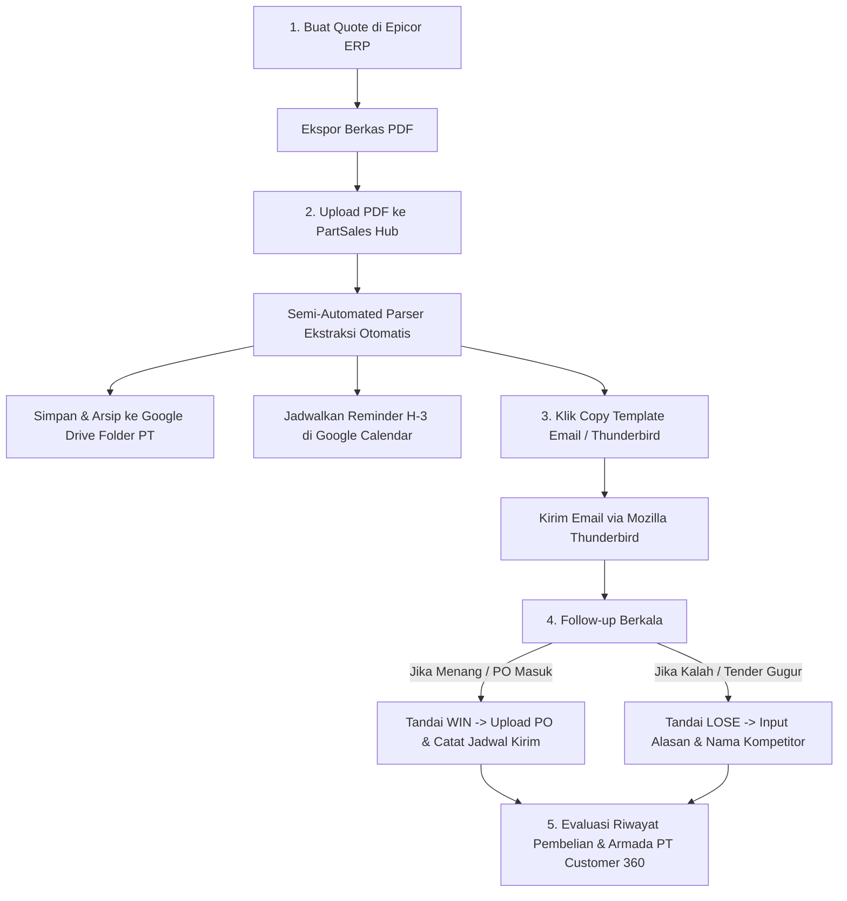
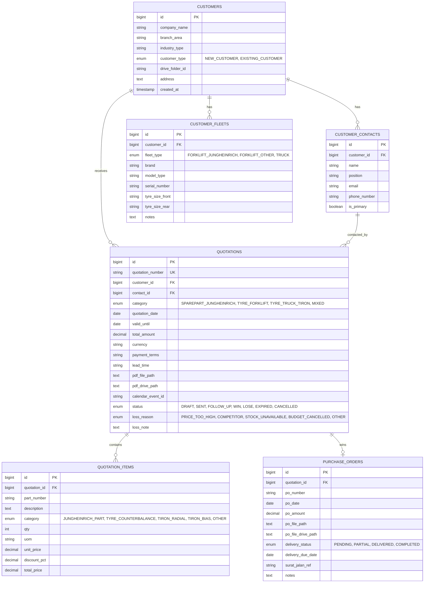

# PartSales Hub (Sales Pipeline & Quotation Management System)
*Dokumentasi Memori Proyek & Panduan Arsitektur Sistem (Obsidian Format)*

#project/bpcapp #crm/quotation #laravel/filament #sales-consultant #kobexindo #deployment

---

## 1. Identitas & Ringkasan Proyek

- **Nama Aplikasi**: PartSales Hub
- **Target Pengguna**: Sales Part Consultant PT Kobexindo Equipment
- **Tech Stack**:
  - **Framework**: Laravel 11.x
  - **Admin Panel / UI Engine**: FilamentPHP v3 (Tailwind CSS, Livewire v3)
  - **Database**: MySQL 8.4 / MariaDB
  - **Ekstraksi PDF**: `smalot/pdfparser`
  - **Integrasi Cloud**: `google/apiclient` (Google Drive API v3 & Google Calendar API v3)
- **Target Deployment**:
  - **Lokal**: Laragon (`C:\laragon\www\bpc-app`, URL: `http://bpc-app.test`)
  - **Repositori Git**: [GitHub nimosasuga/bpcapp](https://github.com/nimosasuga/bpcapp.git)
  - **Server Hosting**: cPanel (IP Server: `103.30.147.68`)
  - **Domain & DNS**: `bpcapp.exprosalab.com` (Cloudflare DNS A record: `bpcapp` -> `103.30.147.68`, Proxy: Auto)

---

## 2. Kategori Produk & Segmentasi Portofolio

Sistem mengelompokkan produk ke dalam 3 rumpun utama sesuai portofolio penjualan:
1. **Sparepart Unit Jungheinrich**:
   - Komponen elektrik, hidrolik, sensor, modul controller.
   - Roda beban (*load wheel*) & roda penggerak (*drive wheel*) polyurethane.
   - Filter & part wear-and-tear untuk unit Forklift Counterbalance, Reach Truck, Stacker, dan Pallet Mover.
2. **Tyre Forklift (Semua Brand)**:
   - Solid Tyre (Ban Mati) Counterbalance, Ban Angin/Pneumatic, Non-Marking White/Grey Tyre, dan Press-on Band untuk berbagai merek forklift (Toyota, Nichiyu, TCM, Komatsu, Mitsubishi).
3. **Ban Truk Komersial Tiron**:
   - Ban Tiron Radial & Tiron Bias (Colt Diesel/Engkel/Double, Tronton, Dump Truck).

---

## 3. Alur Kerja Harian Sales Consultant



---

## 4. Arsitektur Database (ERD)



---

## 5. Rincian Modul & Fungsionalitas Sistem

### Modul 1: Manajemen Quotation & Ekstraksi PDF Epicor (Zero-Typing)
- **1-Click Import Modal (Tanpa Ketik)**:
  - Tombol **⚡ Import PDF Epicor (Otomatis)** pada daftar penawaran (`ListQuotations`).
  - Sales Consultant hanya perlu memilih atau men-drag file PDF penawaran hasil export Epicor Kobexindo.
  - Sistem mengekstrak seluruh data secara otomatis, membuat Customer, PIC Contact, Quotation, dan baris item part di database, lalu mengarahkan ke halaman review/edit.
- **Form Auto-Fill via Livewire**:
  - Pada halaman **Buat Penawaran**, upload PDF pada field `Upload PDF Penawaran Epicor` seketika mengisi seluruh input form dan repeater rincian item.
- **Spesifikasi Ekstraksi Cerdas (`EpicorPdfParserService`)**:
  - **Nomor Quote**: Mendeteksi pola nomor penawaran Epicor (contoh: `36047 Quote Num :`).
  - **Tanggal & Validity**: Mengekstrak `Quote Date` dan `Quote Expired` (contoh: `9/16/2026` dan `10/1/2026`).
  - **Pelanggan & PIC**: Mendeteksi nama PT (contoh: `PT. HERSO TICEP INDONESIA`), alamat lengkap, dan nomor kontak/telepon (contoh: `081911121991`).
  - **Sales Consultant**: Mendeteksi nama sales pada *Authorized Signature* (contoh: `Ilham Firyanto`).
  - **Syarat Pembayaran**: Mendeteksi kode `N2` menjadi `Net 30 Hari`, `N1` menjadi `Net 14 Hari`, `CBD` menjadi `Cash Before Delivery`.
  - **Lead Time**: Mendeteksi kata `INDENT` menjadi `Indent 4-6 Minggu`, atau `READY STOCK`.
  - **Tabel Rincian Part**: Mengekstrak Part Number (contoh `50421067`), Deskripsi (`On-board computer`), Qty, Satuan (`Pcs`), Harga Satuan (`Rp 281.110.000`), Diskon (`5%`), dan Total Harga (`Rp 267.054.500`).
  - **Nilai Total & PPN**: Mengekstrak Sub Total DPP, PPN 11%, dan GrandTotal (`Rp 296.430.495`).
- **Google Drive Archival**:
  - Menyimpan berkas ke struktur folder: `PART CONSULTANTS / {NAMA_PT} / {TAHUN} / Quotation_{Nomor_Quote}.pdf`.
  - Otomatis mencatat `drive_folder_id` di database.
  - Dilengkapi *graceful fallback* ke storage lokal jika kredensial belum dikonfigurasi.
- **Google Calendar Reminder**:
  - Otomatis membuat event pengingat tindak lanjut H-3 sebelum `valid_until` berakhir.

### Modul 2: Generator Template Email Thunderbird
- **Aksi Cepat Sekali Klik**:
  - Tombol **Template Email**: Menampilkan pop-up berisi Subjek dan Isi Pesan yang siap disalin.
  - Tombol **Buka di Thunderbird**: Membuka protokol `mailto:` sehingga langsung membuka compose window di Mozilla Thunderbird dengan penerima, subjek, dan body yang sudah terisi otomatis.
- **Format Pesan Resmi**:
  ```text
  Subject: Penawaran Harga [Kategori Part] - [Nomor Quotation] - PT Kobexindo Equipment to [Nama PT]

  Kepada Yth.
  Bapak/Ibu [Nama PIC]
  [Jabatan PIC]
  [Nama PT]

  Dengan hormat,

  Menindaklanjuti kebutuhan sparepart/tyre untuk unit di perusahaan Bapak/Ibu, berikut kami sampaikan penawaran harga resmi dengan rincian singkat sebagai berikut:

  - No. Penawaran : [Nomor Quotation]
  - Tanggal       : [Tanggal Quote]
  - Masa Berlaku  : s/d [Tanggal Expired]
  - Ringkasan Item: [Item 1, Item 2, dst.]
  - Total Nilai   : Rp [Total Amount] (Termasuk PPN)
  - Lead Time     : [Ready Stock / Indent X Minggu]
  - Syarat Bayar  : [Payment Terms]

  Surat penawaran resmi dalam format PDF telah kami lampirkan pada email ini.

  Mohon dapat direview, dan jika ada hal teknis maupun komersial yang perlu didiskusikan lebih lanjut, kami siap membantu.

  Hormat kami,
  [Nama Anda]
  Part Sales Consultant
  PT Kobexindo Equipment
  Telp / WA: [Nomor Kontak]
  ```

### Modul 3: CRM Customer 360 & Riwayat per PT
- **Profil Pelanggan Terpadu**:
  - Ringkasan total quotation terkirim.
  - Total nominal penawaran menang (WIN) vs kalah (LOSE).
  - Rasio konversi (*Win Rate %*).
- **Tab Relasi**:
  - **Daftar PIC**: Kontak Purchasing, Maintenance, Warehouse.
  - **Armada Unit**: Populasi unit Forklift Jungheinrich, brand lain, serta armada truk komersial beserta ukuran ban depan/belakang untuk prediksi penggantian rutin.
  - **Riwayat Penawaran**: Histori seluruh quotation sebelumnya.

### Modul 4: Follow-up Engine & Google Calendar Integration
- **Indikator Visual Masa Berlaku**:
  - 🟢 **Hijau**: Masa berlaku $> 7$ hari.
  - 🟡 **Kuning**: Masa berlaku $\le 3$ hari (Peringatan segera follow-up).
  - 🔴 **Merah**: Telah kadaluwarsa (*Expired*).
- **Integrasi Google Calendar**:
  - Otomatis membuat event pengingat pada H-3 sebelum `valid_until`.
  - Judul Event: `[FOLLOW UP QUOTE] [Nama PT] - [Nomor Quote] - Nilai Rp [Total]`.
  - Deskripsi: Nama PIC, nomor HP/WA, ringkasan part, dan link detail aplikasi.

### Modul 5: Analisis Win or Lose
- Penawaran status `SENT` dapat diubah menjadi:
  - **WIN**: Membuka modal input data PO Resmi Customer.
  - **LOSE**: Membuka modal wajib berisi alasan kekalahan:
    1. *Harga lebih tinggi dibanding kompetitor (dapat mencatat nama kompetitor)*.
    2. *Ketersediaan barang / lead time terlalu lama*.
    3. *Anggaran pelanggan ditunda/dibatalkan*.
    4. *Unit telah diafkir / diganti unit baru*.
- **Widget Grafik**: Grafik batang rasio Win vs Lose per rumpun part pada Dashboard.

### Modul 6: Pencatatan PO Customer (Order Winning)
- Upload scan/berkas PO resmi customer.
- Pengarsipan otomatis ke Google Drive: `PART CONSULTANTS / {NAMA_PT} / {TAHUN} / PO / PO_{Nomor_PO}.pdf`.
- Pelacakan status pengiriman (*Pending, Partial, Delivered, Completed*), tanggal target kirim, dan nomor surat jalan/faktur.

---

## 6. Kredensial Akun Default

Sistem telah dilengkapi seeder default untuk login:
- **URL Login**: `http://bpc-app.test/admin/login` (Lokal) atau `https://bpcapp.exprosalab.com/admin/login` (Online)
- **Akun Sales Consultant**:
  - **Email**: `sales@kobexindo-equipment.co.id`
  - **Password**: `password`
- **Akun Administrator**:
  - **Email**: `admin@bpcapp.com`
  - **Password**: `password`

---

## 7. Panduan Deployment cPanel & Cloudflare DNS

### 7.1 DNS Cloudflare
- **Domain**: `bpcapp.exprosalab.com`
- **Tipe DNS**: `A` record
- **Name / Subdomain**: `bpcapp`
- **IP Target**: `103.30.147.68`
- **Proxy status**: DNS only atau Proxied (Auto)

### 7.2 Deployment di cPanel (File Manager / Git)
1. **Clone atau Upload ke cPanel**:
   - Jika menggunakan cPanel Git Version Control:
     - Clone URL: `https://github.com/nimosasuga/bpcapp.git`
     - Path: `repositories/bpcapp` atau langsung `public_html/bpcapp`.
   - Jika menggunakan File Manager:
     - Ekstrak seluruh file proyek ke folder subdomain (misal: `public_html/bpcapp`).
2. **Konfigurasi Dokumen Root**:
   - Idealnya subdomain `bpcapp.exprosalab.com` diarahkan ke folder `public_html/bpcapp/public`.
   - Jika document root tidak dapat diubah dari root subdomain, file `.htaccess` yang telah kami sediakan di root akan secara otomatis meneruskan seluruh traffic ke `public/` dengan aman.
3. **Konfigurasi `.env` Production**:
   - Salin `.env.example` menjadi `.env`.
   - Sesuaikan konfigurasi database MySQL cPanel:
     ```env
     APP_NAME="PartSales Hub"
     APP_ENV=production
     APP_DEBUG=false
     APP_URL=https://bpcapp.exprosalab.com

     DB_CONNECTION=mysql
     DB_HOST=127.0.0.1
     DB_PORT=3306
     DB_DATABASE=nama_cpanel_bpcapp
     DB_USERNAME=nama_cpanel_user
     DB_PASSWORD=password_database_anda
     ```
4. **Menjalankan Migrasi & Storage Link (via cPanel Artisan Runner)**:
   - Jika tidak memiliki akses terminal/SSH di cPanel, buka browser dan akses URL:
     `https://bpcapp.exprosalab.com/cpanel_artisan.php?token=bpcapp2026_deploy_secret&cmd=migrate`
   - Untuk membuat storage link:
     `https://bpcapp.exprosalab.com/cpanel_artisan.php?token=bpcapp2026_deploy_secret&cmd=storage_link`
   - Untuk menjalankan seed demo data (opsional):
     `https://bpcapp.exprosalab.com/cpanel_artisan.php?token=bpcapp2026_deploy_secret&cmd=seed`
   - Untuk membersihkan cache dan optimasi:
     `https://bpcapp.exprosalab.com/cpanel_artisan.php?token=bpcapp2026_deploy_secret&cmd=optimize`

---

## 8. Pemeliharaan & Integrasi Google Cloud

Untuk mengaktifkan Google Drive & Google Calendar secara penuh:
1. Buat Service Account di Google Cloud Console.
2. Berikan role Editor pada Service Account tersebut.
3. Unduh berkas JSON kredensial dan letakkan di `storage/app/google/service-account.json`.
4. Bagikan (*Share*) folder induk Google Drive Anda kepada email Service Account dengan akses *Editor*.
5. Masukkan ID folder Google Drive ke `.env`:
   ```env
   GOOGLE_SERVICE_ACCOUNT_JSON=storage/app/google/service-account.json
   GOOGLE_DRIVE_ROOT_FOLDER_ID=1AbCdEfGhIjKlMnOpQrStUvWxYz
   GOOGLE_CALENDAR_ID=primary
   ```
6. Jalankan `php artisan config:clear`.
